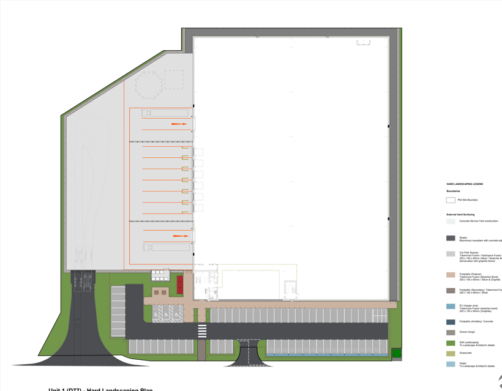
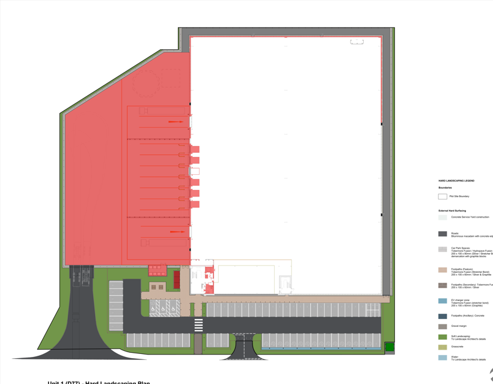
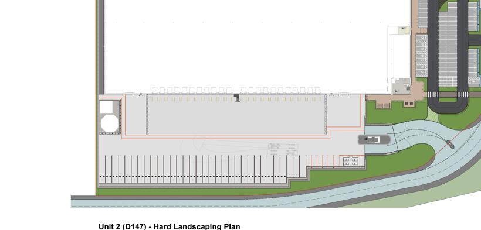
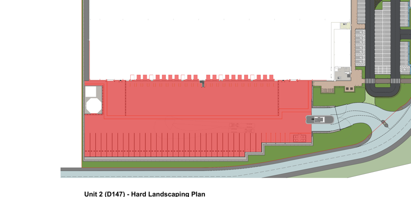
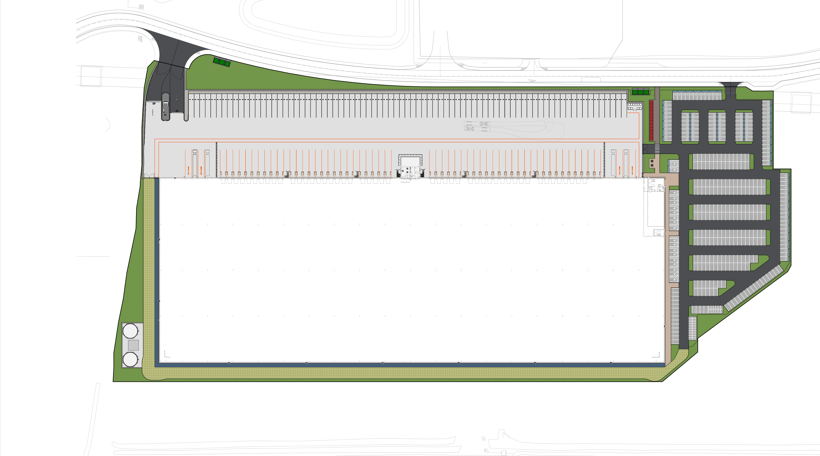
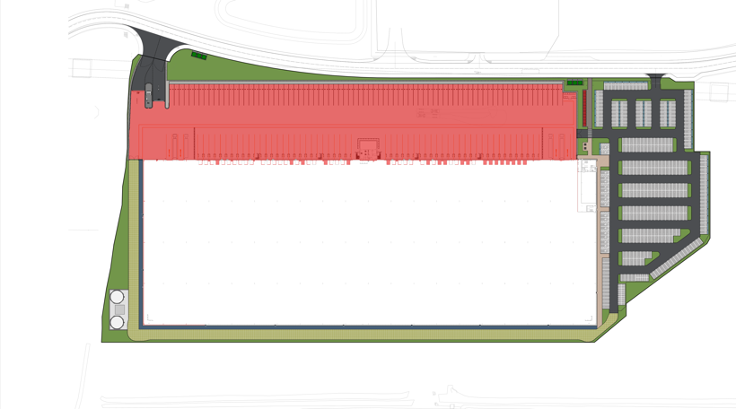
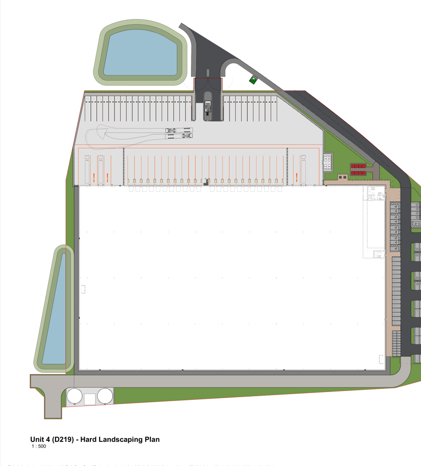
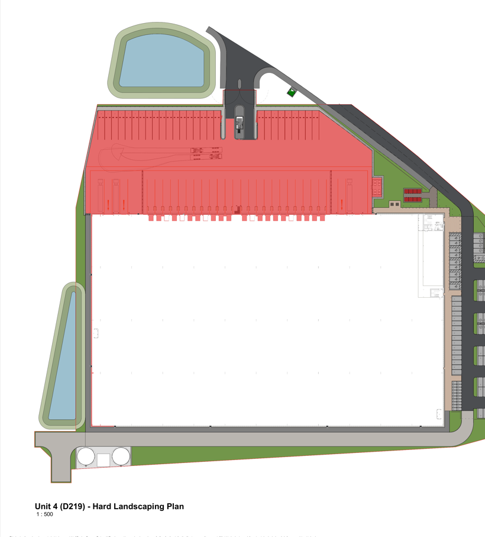

# Fortel AI Takeoff — Demo 3: Claude session  vs  code workflow (must agree)

*The dev's point: "when **you** run the flow it works, but the **.py file** doesn't." Demo 3 settles it.
We run the **two flows on the same unmarked SGP drawings** and put the numbers side by side:*

- **Claude session** — me doing the takeoff interactively (the method behind `DEMO2.md`).
- **Code workflow** — `python3 takeoff_unmarked.py <drawing.pdf>`, no human in the loop.

*A discrepancy showed up, I root-caused it and fixed it, and the two now agree to **+0.00%** on every unit.*

---

## Result — identical, all four units (render scale S = 2.0)

| Unit (unmarked) | Claude session | Code `takeoff_unmarked.py` | Δ |
|---|---|---|---|
| D77  — Hard Landscaping 1:250 | 3,238 m² · £145,354 | **3,238 m² · £145,354** | **+0.00%** |
| D147 — Hard Landscaping 1:500 | 6,584 m² · £295,556 | **6,584 m² · £295,556** | **+0.00%** |
| D410 — Hard Landscaping 1:750 | 16,697 m² · £749,528 | **16,697 m² · £749,528** | **+0.00%** |
| D219 — Hard Landscaping 1:500 | 7,509 m² · £337,079 | **7,509 m² · £337,079** | **+0.00%** |
| **Total** | 34,028 m² · £1,527,517 | **34,028 m² · £1,527,517** | **+0.00%** |

The code now reproduces the Claude-session takeoff exactly — same legend reading, same region, same
area, same price. (Cross-checked on shared renders unit-by-unit: every Δ = +0.00%.)

---

## The discrepancy we found — and the fix

Before the fix the script ran **~1% low** vs the session:

| Unit | session | code (before) | Δ before |
|---|---|---|---|
| D77  | 3,265 m² | 3,236 m² | −0.89% |
| D147 | 6,655 m² | 6,563 m² | −1.40% |

**Root cause.** Both flows segment the grey "Concrete Service Yard" hatch, but with a slightly different
grey test:
- **session:** a *luminance band* on one channel + a greyscale check — `|r−g|<12 & |g−b|<12 & 200≤r≤228`.
- **code (before):** a *per-channel* box — `|r−214|≤14 & |g−214|≤14 & |b−214|≤14`.

On a flat fill these are the same, but along anti-aliased edges (bay lines, text, the building wall) they
include/exclude different pixels → ~1%.

**Fix** (in `takeoff_unmarked.py › segment_hatch`): for a grey target, use the session's exact predicate.
```python
if max(rgb) - min(rgb) <= 6:                      # grey hatch
    mask = (abs(r-g)<12) & (abs(g-b)<12) & (r>=R-tol) & (r<=R+tol)   # luminance band + greyscale
else:                                             # coloured hatch
    mask = (abs(r-R)<=tol) & (abs(g-G)<=tol) & (abs(b-B)<=tol)
```
After the fix the per-unit Δ is **+0.00%** (table above), and this is locked in by `test_sgp_units.py`
(regression on the 4 units) and `ci_tests.py` (22/22, includes the segmentation logic).

---

## What each unit looks like (region is identical in both flows)

The "after" overlay is the measured concrete-yard region — the **same pixels** in the session and the
script, so one image represents both.

### D77 (1:250) — 3,238 m² → £145,354
| Unmarked drawing | Region measured (session ≡ code) |
|:---:|:---:|
|  |  |

### D147 (1:500) — 6,584 m² → £295,556
| Unmarked drawing | Region measured (session ≡ code) |
|:---:|:---:|
|  |  |

### D410 (1:750) — 16,697 m² → £749,528
| Unmarked drawing | Region measured (session ≡ code) |
|:---:|:---:|
|  |  |

### D219 (1:500) — 7,509 m² → £337,079
| Unmarked drawing | Region measured (session ≡ code) |
|:---:|:---:|
|  |  |

---

## How to reproduce
```bash
python3 takeoff_unmarked.py ".../Unit_1_(D77)_-_Hard_Landscaping.pdf"
#   AREA = 3,238 m2   RATE = GBP 44.89/m2   PRICE = GBP 145,354
python3 test_sgp_units.py     # PASS D77/D147/D410/D219 (regression vs the session numbers)
python3 ci_tests.py           # 22/22 PASS
```

## Honest notes (unchanged from Demo 2 / the standup)
- SGP is the **architect**, so these are architect-drawing areas: build-up is **assumed** (190 mm / A252,
  stated as an assumption) and the area carries a **~5% tolerance** vs an engineer drawing. The £'s are
  indicative on that assumed build-up — exactly how Fortel issue it when there's no engineer pack.
- The exact boundary is still an **assessor confirm** (±5–10%); the script proposes, the assessor signs off.
- Numbers are at render scale **S = 2.0** (the canonical setting); `session ≡ code` holds at any S because
  both share the render and now use one segmentation function.
