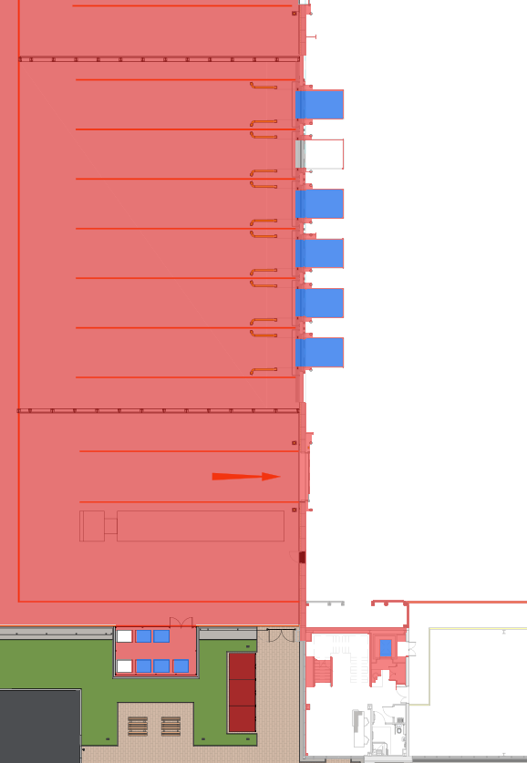
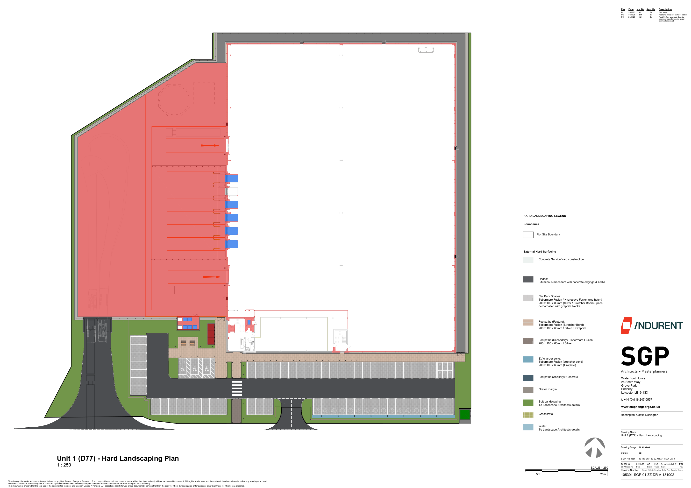
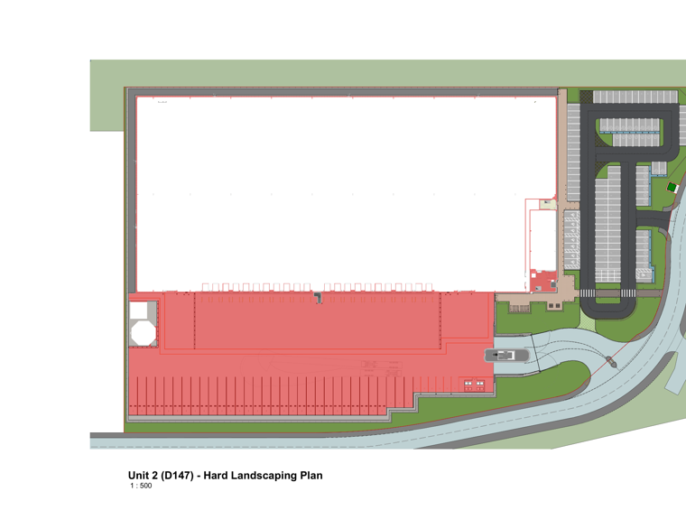
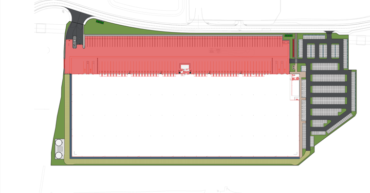
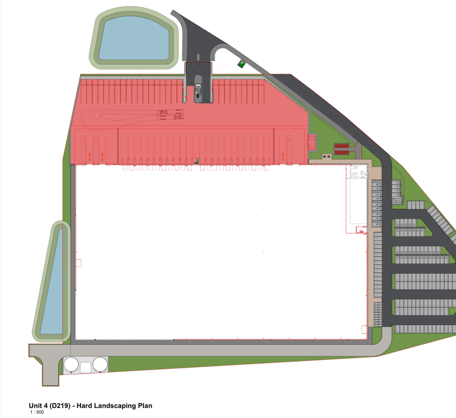

# Fortel AI Takeoff — Demo 4: team feedback fixed, more examples

*Builds on Demo 3 (code workflow == Claude session). This round folds in the **team's test feedback**
on `takeoff_unmarked.py` and adds **non-colour-coded** drawings to the example set.*

## Team feedback (from the Aryan/Smita test) — and what we did

| # | Feedback | Verdict | Fix |
|---|---|---|---|
| 1 | "Misses by a few m² — it's calculating the **bay area inside the building**." D77: code **3,238**, Smita's Bluebeam **3,156**. | **Correct.** We were hole-filling the **dock-bay door recesses**. | Stop filling large white pockets; keep dock bays & islands as **deductions**. D77 → **3,172** (**+0.5%** vs Smita). |
| 2 | "Works only for **colour-coded** files; on a non-colour-coded file it gives **entirely wrong area**." | **Correct.** On line/hatch engineer sheets the grey segmentation scraped stray pixels (Winvic yard → bogus 153 m²). | Detect **drawing style** (solid-fill vs line/hatch); on line/hatch **emit no number** and route to hatch-mode / vision / assessor. |
| 3 | "Can I get the **measured PDF** to check in Bluebeam?" | Reasonable. | Shipped `demo4/D77_measured.pdf` (red = measured yard) — open it over the original in Bluebeam. |

*(Smita's note "might not always be correct" is fair — but here she was. The fix is principled either way:
don't fill structural recesses, and don't guess on a drawing type the method can't read.)*

---

## Fix 1 — the dock bays (exactly what Smita circled)

She circled the white notches along the building edge: *"these shouldn't be included."* They're the
**dock-leveller door recesses** — `fill_holes` was filling them (+~68 m²). Now they're excluded.



**Red = counted concrete yard. Blue = the dock bays we now EXCLUDE** (what Smita flagged). Result:

| | area | vs Smita (3,156) |
|---|---|---|
| before (filled dock bays) | 3,238 m² | +2.6% |
| **after (dock bays deducted)** | **3,172 m²** | **+0.5%** |

---

## Fix 2 — non-colour-coded drawings now refuse instead of guessing

The colour segmentation is only valid on **solid-fill** sheets (SGP architect). On a **line/hatch**
engineer drawing (the RBVE kerbing style — thin lines + diagonal hatching) it has nothing solid to
measure. We detect this (solid-fill fraction after erosion: colour-coded ≈ 13–23%, line/hatch ≈ 0.5%)
and **stop**:

```
=== UNMARKED_Yard.pdf (line-art) ===
  NO AREA EMITTED
   - drawing style: line/hatch (solid-fill 1%)
   - NON-COLOUR-CODED drawing — solid-fill segmentation does NOT apply; route to
     hatch-mode / Claude vision / assessor trace. No area emitted.
```
Before: it reported a nonsense **153 m² / £6,868**. Now it reports **nothing** and says why. *(Building a
real hatch-mode for engineer sheets needs one of their actual kerbing PDFs — please share the RBVE file
and we'll add it; the route is already wired.)*

---

## Results — colour-coded SGP units (code == Claude session), AFTER the fix (S = 2.0)

| Unit (unmarked) | Claude session | Code `takeoff_unmarked.py` | Δ | vs manual |
|---|---|---|---|---|
| D77  (1:250) | 3,172 m² · £142,391 | **3,172 m² · £142,391** | +0.00% | Smita 3,156 → **+0.5%** |
| D147 (1:500) | 6,438 m² · £289,002 | **6,438 m² · £289,002** | +0.00% | — |
| D410 (1:750) | 16,384 m² · £735,478 | **16,384 m² · £735,478** | +0.00% | — |
| D219 (1:500) | 7,378 m² · £331,198 | **7,378 m² · £331,198** | +0.00% | — |
| **Total** | 33,372 m² · £1,498,069 | **same** | **+0.00%** | |

Session and code call the **same** `segment_hatch`, so they remain identical (Demo 3 result holds).

## Examples at a glance (more than Demo 3)

| Drawing | Type | Style | Result |
|---|---|---|---|
| SGP D77 / D147 / D410 / D219 | architect hard-landscaping | colour-coded | measured (table above) |
| Winvic UNMARKED_Yard | engineer site plan | line/hatch | **refused** → vision/assessor |
| Winvic UNMARKED_Dock | engineer site plan | line/hatch | **refused** → vision/assessor |

### Measured regions (dock bays now excluded)
| D77 | D147 | D410 | D219 |
|:---:|:---:|:---:|:---:|
|  |  |  |  |

---

## The fixes in code (`takeoff_unmarked.py`)
```python
# Fix 1 — size-limited hole fill: paint/text holes (small) get filled; dock bays / islands (large)
#         stay OUT as deductions.  k makes the threshold real-world (m²), so it's scale-correct.
if k:
    px_per_m2 = 1.0 / ((1.0/S)**2 * k*k)
    holes = label(fill_holes(comp) & ~comp)
    comp |= holes_smaller_than(max_void_m2 * px_per_m2)      # default 1.0 m²

# Fix 2 — drawing-style guard: erode 2px (solid fills survive, thin lines vanish); refuse line/hatch
solid = binary_erosion(nonwhite, iterations=2).mean()
style = "colour-coded" if solid > 0.03 else "line/hatch"     # line/hatch -> emit no number
```
Locked in by tests: `ci_tests.py` **26/26** (adds style-guard + void-deduction), `test_sgp_units.py`
(regression on the 4 units, now to the corrected numbers).

## Honest notes
- D77 lands **+0.5%** of Smita's manual trace; the others have no manual yet — please spot-check
  `D77_measured.pdf` in Bluebeam and send any manual areas for D147/D410/D219 and we'll calibrate.
- SGP is the **architect** → build-up **assumed** (190 mm / A252), area ~**5%** tolerance vs an engineer
  drawing; £'s indicative, exactly as Fortel issue them without an engineer pack.
- **Non-colour-coded (engineer) sheets are not yet measured** — detection + refusal is in; the hatch-mode
  needs a real RBVE/kerbing PDF to build and validate against.
